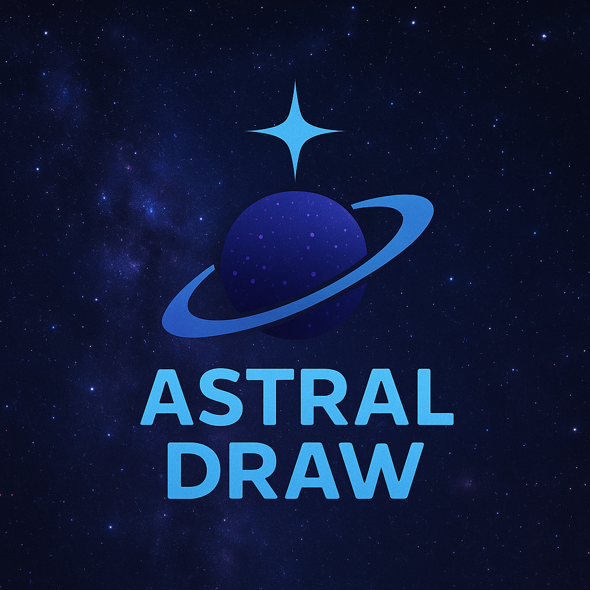
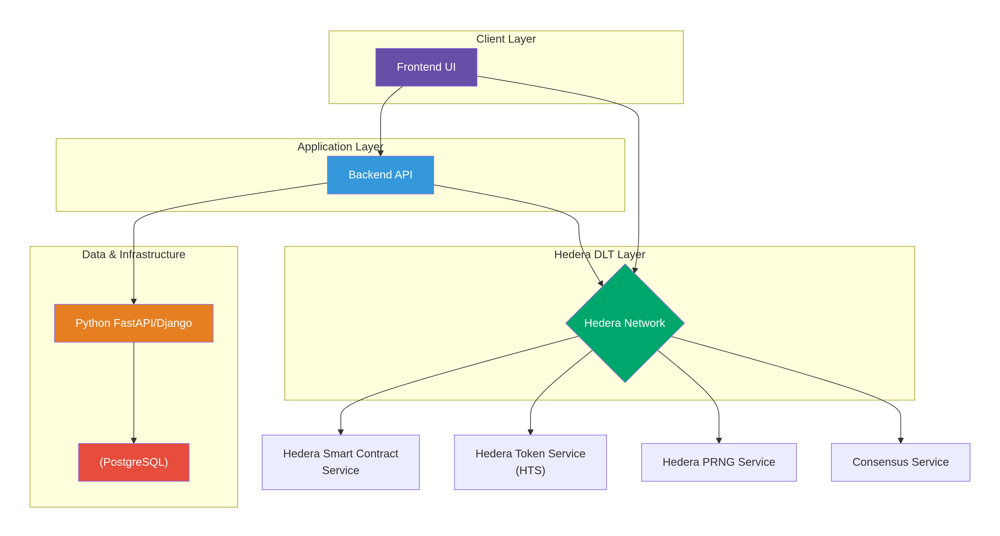

# 🌌 Astral Draw – The Cosmic NFT Lottery on Hedera



**Astral Draw** is a next-generation, blockchain-powered lottery platform built on **Hedera Hashgraph**.  
We reimagine the traditional lottery experience through an **immersive cosmic narrative**, **NFT-gated participation**,  
and **provable fairness** that anyone can verify on-chain.

---

## 🚀 Vision & Mission

The global lottery industry is worth **$300B+**, yet it suffers from:
- Lack of transparency  
- Trust issues with centralized operators  
- Limited accessibility for global players  

**Astral Draw’s Mission:**  
> Build the **most trusted** and **exciting lottery platform** worldwide,  
> enabling $100B+ in lifetime payouts through fair, inclusive, and verifiable technology.

---

## ❌ The Problem vs. ✅ The Astral Draw Solution

| Traditional Pain Points | Astral Draw Solution |
|------------------------|---------------------|
| ❌ **Opaque & Centralized** – Draws are trust-based and off-chain | ✅ **Provably Fair** – Uses Hedera’s VRF-powered PRNG; results are on-chain and verifiable |
| ❌ **Paper Tickets** – Easily lost/damaged, non-transferable | ✅ **NFT Star Keys** – Each ticket is a unique, tradable asset minted via Hedera Token Service (HTS) |
| ❌ **High Operational Costs** – Lower prize pools for players | ✅ **Low Gas Fees & Automation** – Hedera’s efficiency maximizes prize pool payouts |
| ❌ **Limited Access** – Geographic & banking restrictions | ✅ **Global & Inclusive** – Entry via HBAR, USDC, or fiat onramps |

---

## ✨ Core Features

| Feature | Icon | Description |
|--------|------|-------------|
| **Star Key NFTs** | 🛠️ | Each lottery ticket is a unique, verifiable, and tradable NFT on Hedera HTS |
| **Provably Fair Draws** | 🎲 | Powered by Hedera `getPrng()`, guaranteeing cryptographic randomness |
| **Nebula Vault** | 💰 | Automated prize pool smart contract that instantly distributes rewards |
| **On-Chain Transparency** | 🔗 | All ticket sales, draws, and payouts are logged immutably on Hedera |
| **Modern UI/UX** | 📱 | Cosmic-themed, responsive dashboard with real-time draw countdowns |
| **Multi-Payment Support** | 🌐 | Pay with HBAR, USDC, or Fiat via secure onramps |

---

## 🛠 Technology Stack



| Layer | Technology |
|------|-------------|
| **Ledger** | Hedera Hashgraph |
| **Smart Contracts** | Hedera Smart Contract Service (Solidity/EVM) |
| **NFT Ticketing** | Hedera Token Service (HTS) |
| **Randomness** | Hedera PRNG (`getPrng()`) |
| **Backend** | Python (FastAPI/Django) |
| **Frontend** | htmx + Tailwind CSS + Framer Motion |
| **Database** | PostgreSQL |
| **Payments** | HBAR, USDC, Fiat via onramp |

---

## 🧩 How It Works – The Player’s Journey

### 1️⃣ Forge a Star Key (Buy Ticket)
- Player buys a ticket → Star Key NFT is minted instantly  
- NFT metadata stores ticket numbers + draw ID  
- Payment accepted in HBAR, USDC, or Fiat  

### 2️⃣ Astral Convergence (The Draw)
- When draw ends, backend calls **Hedera PRNG** to generate 6 numbers (0-9 range)  
- Random seed & results submitted to **Hedera Consensus Service (HCS)** for public verification  

### 3️⃣ Select Champions of the Cosmos (Winner Selection)
- Smart contract (`Oracle of Fate`) uses the verified numbers to pick winners  
- Matches are automatically checked against all NFTs in that draw  

### 4️⃣ Distribute the Nebula Vault (Prize Payout)
- Prize pool auto-distributes HBAR to winning wallets  
- 100% on-chain, trustless & auditable  

---

## 📊 Metrics & Goals

| Metric | Target |
|-------|--------|
| **User Adoption** | 1M+ users within first 3 years |
| **Prize Payouts** | $100M+ distributed within first year |
| **Transaction Costs** | < $0.001 per operation (thanks to Hedera) |


---

## 🔮 Future Roadmap

| Phase | Key Milestones |
|------|----------------|
| 🟢 **Phase 1 – Genesis** | Launch Core Lottery, Star Key NFTs, PRNG integration, Nebula Vault smart contracts |
| 🟡 **Phase 2 – Constellation** | Launch Star Key NFT marketplace, recurring draws, animated UI/UX |
| 🔵 **Phase 3 – Universe** | Multi-chain support, cross-chain NFT bridges, branded draws for partners |
| 🟣 **Phase 4 – Metaverse** | AR/VR Star Key viewers, immersive draw watch parties |

---

## 🤝 Contributing

We welcome community contributions!  

```bash
# Fork & Clone the repository
git clone https://github.com/DevTitos/AstralDraw.git

# Create a feature branch
git checkout -b feature/AmazingFeature

# Commit and push changes
git commit -m "Add AmazingFeature"
git push origin feature/AmazingFeature
